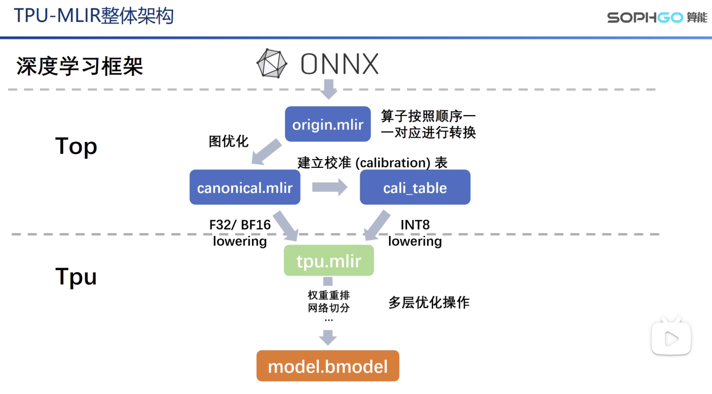
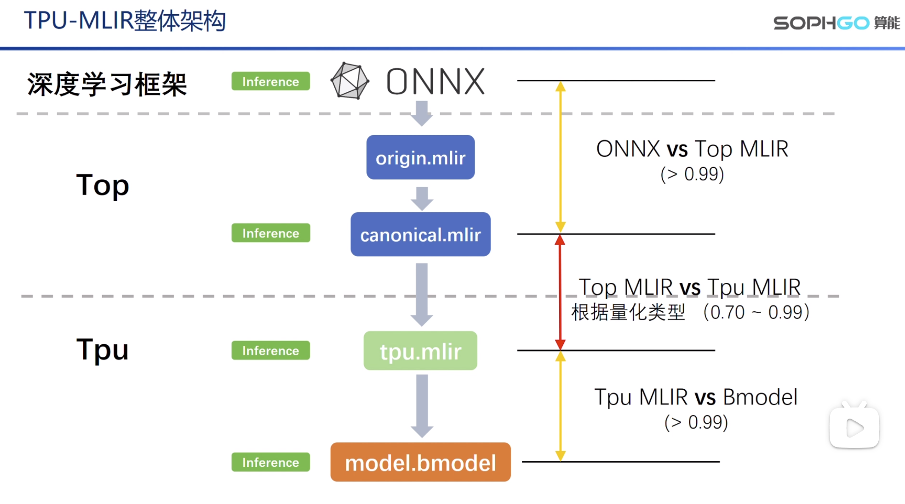
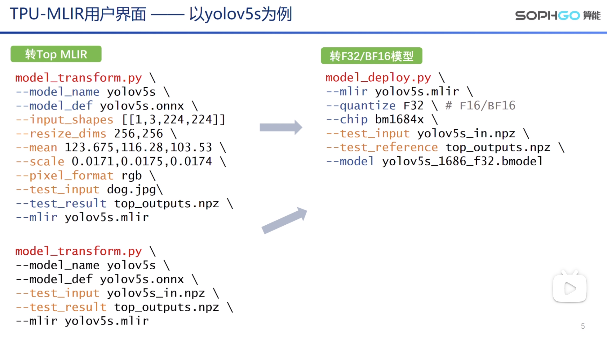
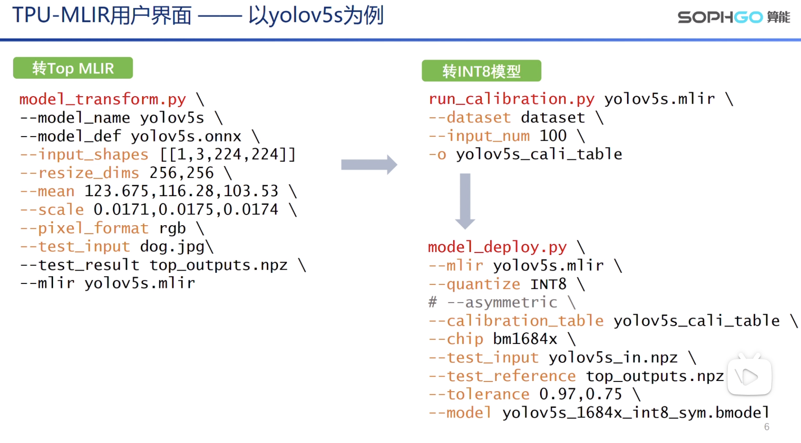

# TPU-MLIR简介

**为什么要认识TPU-MLIR**

- 之后分享的技术内容会围绕TPU-MLIR展开（MLIR，网络优化操作...）
- 所有技术知识都在TPU-MLIR有具体实现
- 现在相关的资料比较少，TPU-MLIR可以用来深入了解AI编译器+MLIR实战

项目地址(https://github.com/sophgo/tpu-mlir)

TPU-MLIR整体架构

在各个阶段进行模型推理，对比他们的结果，除了在量化中不可避免的产生偏差，其余阶段
都要求达到99%以上。

