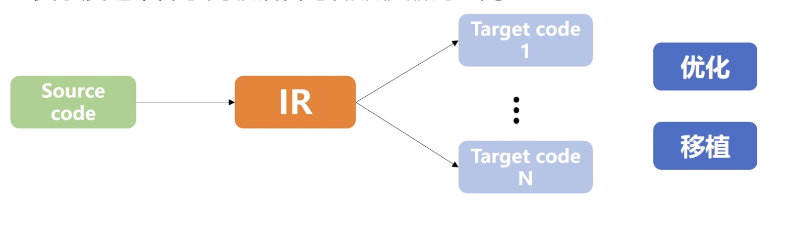
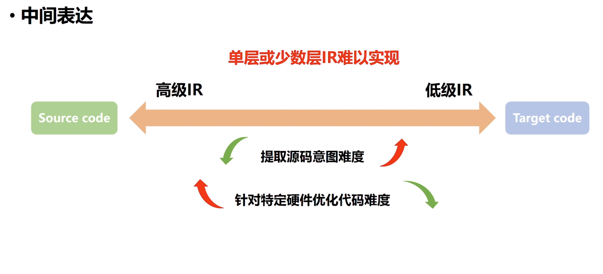
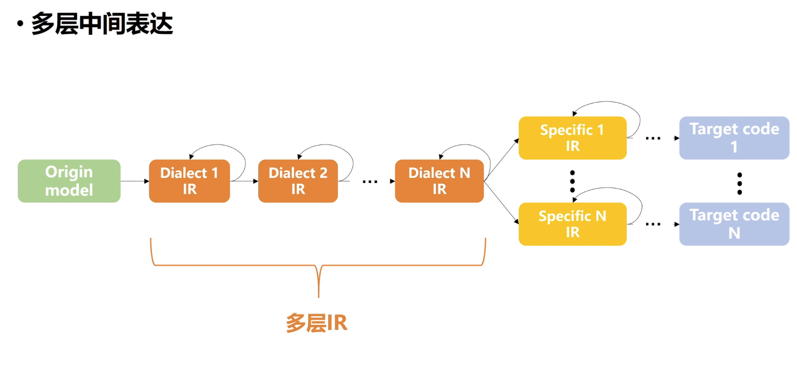
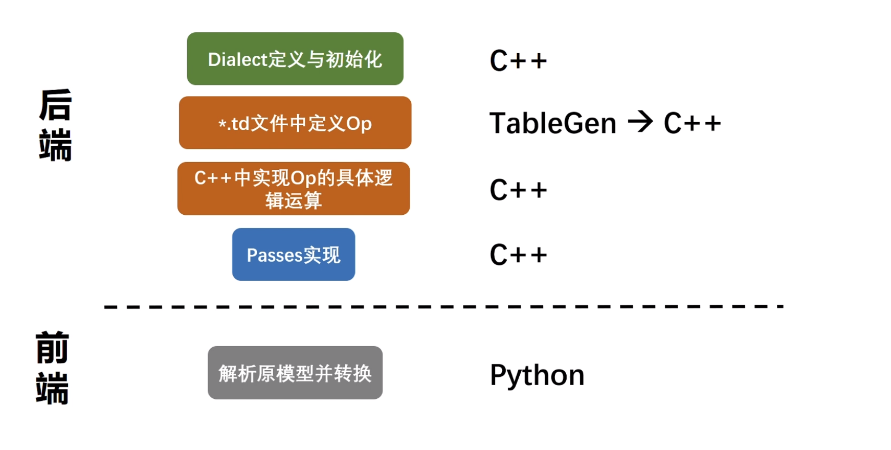

# 

**什么是MLIR?**

MLIR （Multi-Level Intermediate Representation）

- LLVM下的子项目
- 编译器基础框架
- 统一IR格式，提高通用与可复用性
- 自带Tensor类型，目前主要用于深度学习领域

**中间表达（Intermediate Representation）**
- 编译器在编译过程中形成的中间代码
- 复杂度通常介于高级语言与低级机器码之间

在深度学习领域，IR可以被理解为一个深度学习框架的中间格式，同样也可以用来表示一个深度学习模型。

但是依靠单层或少数层IR难以实现Source到Target code的转换。

面对一个问题，IR越高级，越接近源代码，提取源代码意图难度的能力就越高，但是针对特定硬件
优化代码难度就越高。反之，IR越低级，提取源代码意图难度的能力就越低，但是针对特定硬件
优化代码难度就越低。

同时，也要考虑到IR的通用和复用性，如果IR是单层或者少数层，当我们需要生成不同硬件使用的目标代码时，
其实在这个过程中，有相当一部分功能是相同的，我们也仍然需要重新去实现它。

而且，如果通过少数层之间进行转换，IR之间跨度大，实现开销大。

Dialect是一个MLIR实现多层IR核心的概念

**Dialect**

- Prefix
  - 命名空间（e.g. Top, Tpu）
- Operations
  - 一系列的操作，每个操作对应深度学习模型中的单个算子(e.g. ConvOp)
- Passes
  - Dialect内的转换 （Top层的图优化）
  - Dialect间的转换  （Top层lower到Tpu层）

