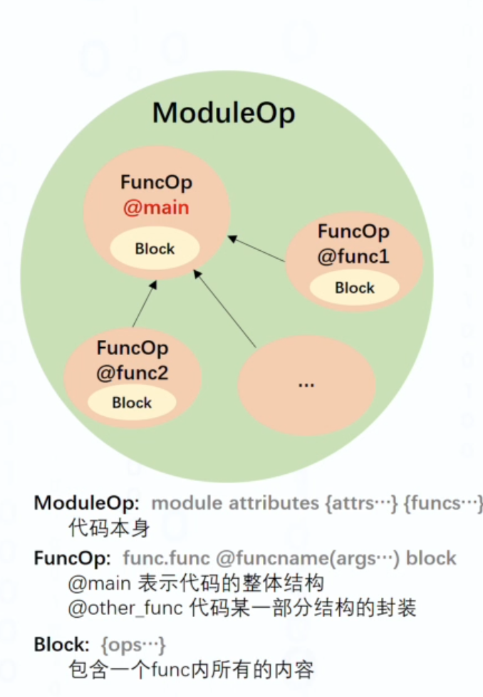
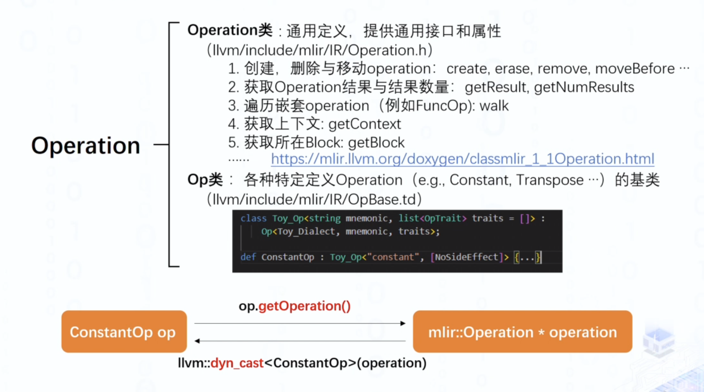
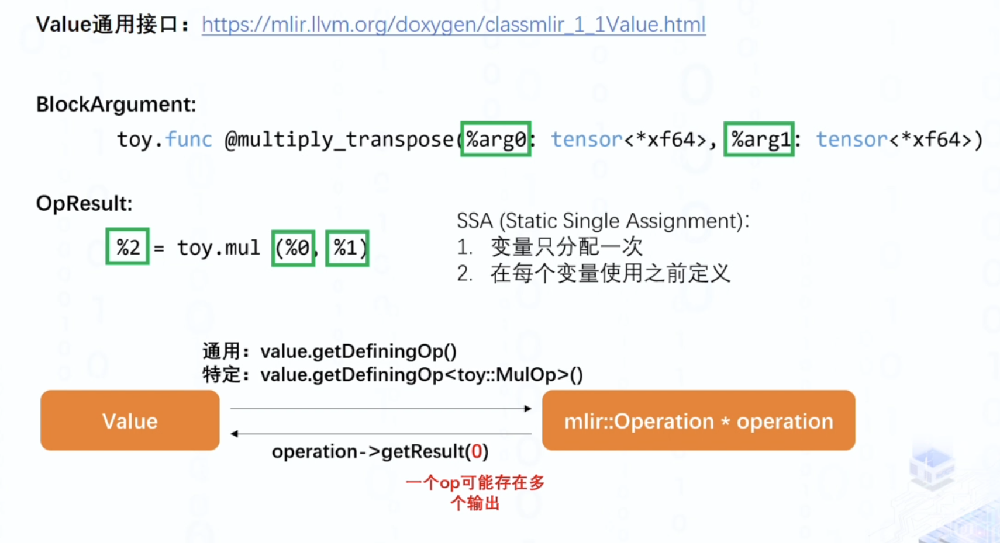
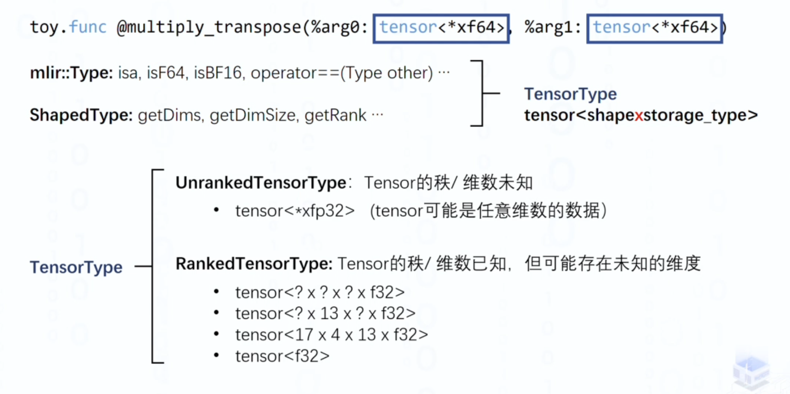
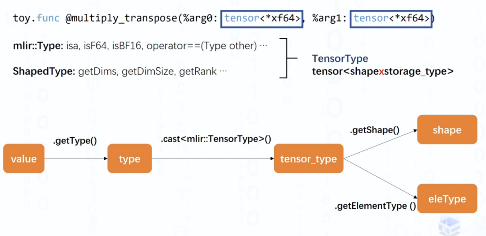
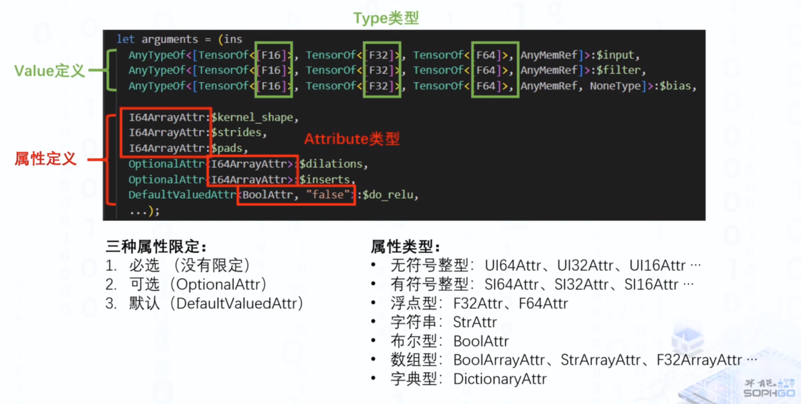
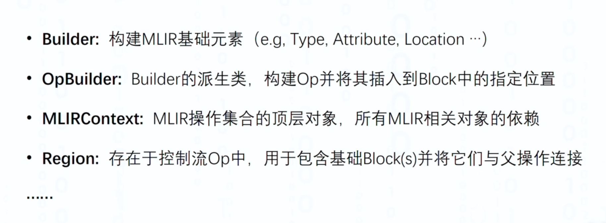

#

以一个toy语言的例子来讲解，可以在llvm-project/mlir/test/Examples/Toy/Ch2/codegen.toy 里面找到，代码如下：

``` 

def multiply_transpose(a, b) {
  # 对a,b进行转置相乘
  return transpose(a) * transpose(b);
}

def main() {
  var a<2, 3> = [[1, 2, 3], [4, 5, 6]];
  var b<2, 3> = [1, 2, 3, 4, 5, 6];
  # a , b 转置相乘 赋值给 c
  var c = multiply_transpose(a, b);
  # b , a 转置相乘 赋值给 d
  var d = multiply_transpose(b, a);
  print(d);
}

```

下面是转化成的mlir文本

``` 
module  {
  func @multiply_transpose(%arg0: tensor<*xf64> loc("../mlir/test/Examples/Toy/Ch2/codegen.toy":4:1), %arg1: tensor<*xf64> loc("../mlir/test/Examples/Toy/Ch2/codegen.toy":4:1)) -> tensor<*xf64> {
    %0 = toy.transpose(%arg0 : tensor<*xf64>) to tensor<*xf64> loc("../mlir/test/Examples/Toy/Ch2/codegen.toy":5:10)
    %1 = toy.transpose(%arg1 : tensor<*xf64>) to tensor<*xf64> loc("../mlir/test/Examples/Toy/Ch2/codegen.toy":5:25)
    %2 = toy.mul %0, %1 : tensor<*xf64> loc("../mlir/test/Examples/Toy/Ch2/codegen.toy":5:25)
    toy.return %2 : tensor<*xf64> loc("../mlir/test/Examples/Toy/Ch2/codegen.toy":5:3)
  } loc("../mlir/test/Examples/Toy/Ch2/codegen.toy":4:1)
  func @main() {
    %0 = toy.constant dense<[[1.000000e+00, 2.000000e+00, 3.000000e+00], [4.000000e+00, 5.000000e+00, 6.000000e+00]]> : tensor<2x3xf64> loc("../mlir/test/Examples/Toy/Ch2/codegen.toy":9:17)
    %1 = toy.reshape(%0 : tensor<2x3xf64>) to tensor<2x3xf64> loc("../mlir/test/Examples/Toy/Ch2/codegen.toy":9:3)
    %2 = toy.constant dense<[1.000000e+00, 2.000000e+00, 3.000000e+00, 4.000000e+00, 5.000000e+00, 6.000000e+00]> : tensor<6xf64> loc("../mlir/test/Examples/Toy/Ch2/codegen.toy":10:17)
    %3 = toy.reshape(%2 : tensor<6xf64>) to tensor<2x3xf64> loc("../mlir/test/Examples/Toy/Ch2/codegen.toy":10:3)
    %4 = toy.generic_call @multiply_transpose(%1, %3) : (tensor<2x3xf64>, tensor<2x3xf64>) -> tensor<*xf64> loc("../mlir/test/Examples/Toy/Ch2/codegen.toy":11:11)
    %5 = toy.generic_call @multiply_transpose(%3, %1) : (tensor<2x3xf64>, tensor<2x3xf64>) -> tensor<*xf64> loc("../mlir/test/Examples/Toy/Ch2/codegen.toy":12:11)
    toy.print %5 : tensor<*xf64> loc("../mlir/test/Examples/Toy/Ch2/codegen.toy":13:3)
    toy.return loc("../mlir/test/Examples/Toy/Ch2/codegen.toy":8:1)
  } loc("../mlir/test/Examples/Toy/Ch2/codegen.toy":8:1)
} loc(unknown)
```

MLIR由三部分组成，由Module、Function、Block三部分组成。



在上面三种层次的结构下，mlir又有一些基本概念，其中重要的如下：

- Operation: 运算
- Value：操作数
- Type： Value的类型
- Attribute： Op的属性

**Operation**是mlir中的一个基本执行单元，它的构建是为了在特定Dialect下对源码或者上一层
IR进行表达，并通过Operation对其进行变换，以达到编译优化的效果。



**Value**




**Type**







**Attribute**

用于定义特定op的属性



**其他概念**



