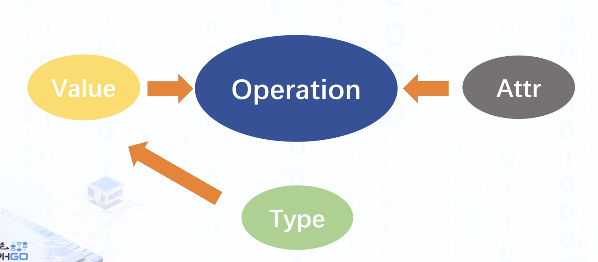
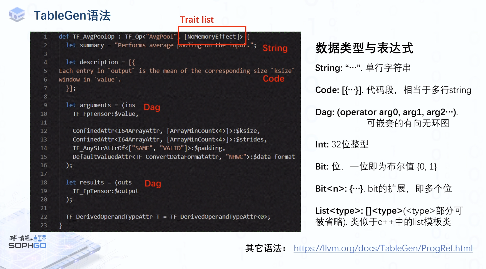
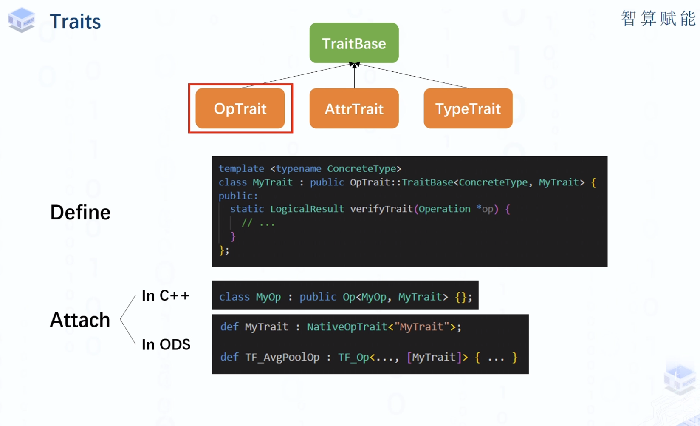
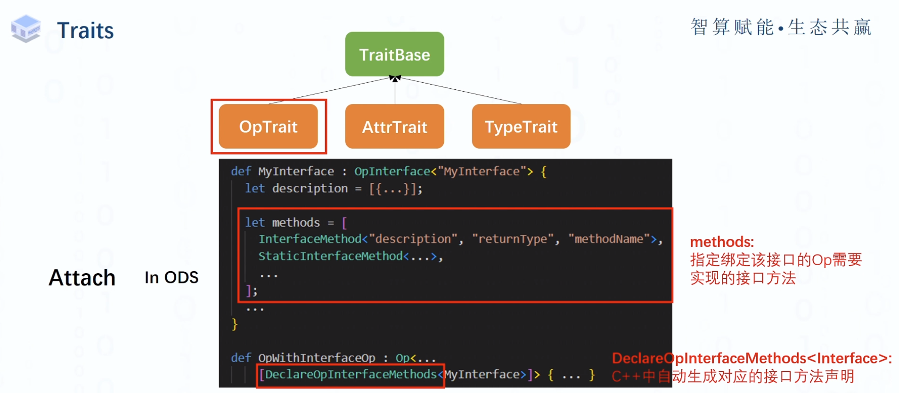
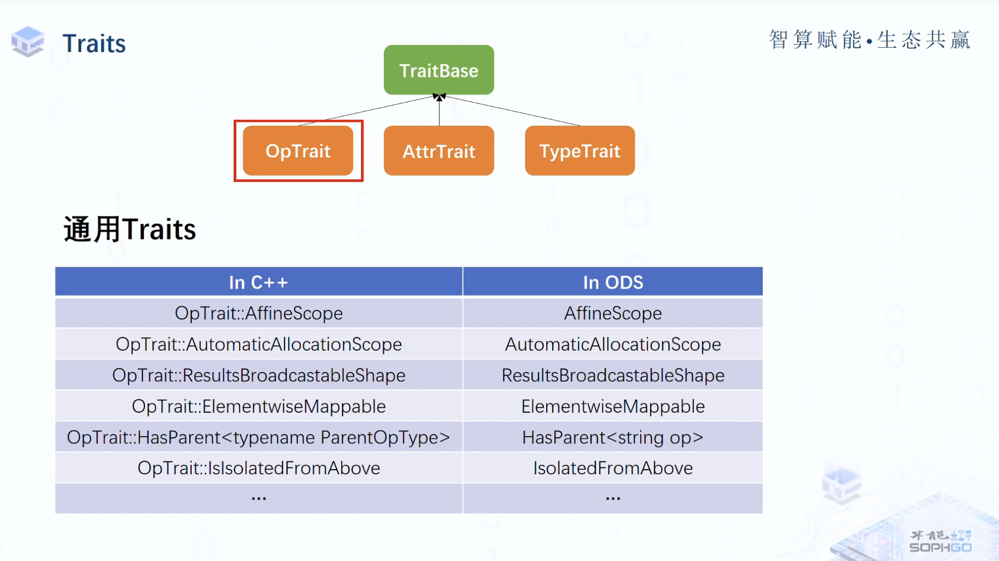

#


前面提到的type、value、attribute都是为Operation服务的



**Op定义方式**

MLIR中提供的Op定义：

- 直接在C++中的定义
  - 对于每个Dialect都要继承Op基类并重写部分构造函数
  - 每个Op都要编写相应的C++代码
  - 冗余
  - 可读性差
- Operation Definition Specification（ODS）
  - 在td文件中编写Op定义
  - 利用TableGen自动生成相应的C++代码
  - Op定义简易直观


**OpBase.td中提供的公共结构：(llvm/include/mlir/IR/OpBase.td)**

- Op类：各种特定定义Op(e.g. Constant, Transpose ...)的基类
- Dialect类：归属于同一逻辑组的Op会被放置在同一Dialect下，其中包含抽象等级信息
- TypeConstraint类：对于操作数的约束
- AttrConstraint类：对于Op中Attr的约束
- OpTrait类：指定Op的特殊属性（properties）和约束（e.g. 某一op的输入和输出shape相同）
- ins/outs标记： 引导Op参数与结果定义的特殊标记

**TableGen语法**

类与定义（和llvm中一致）
- class:
  - 与C++中的class相似，可作为模板或基类去派生子类
- def:
  - 与C++中的object相似，不可作为模板或基类
  - 可以用class的特化来声明，也可以单独使用


举例，如下：

``` 
class Toy_op<string mnemonic, list<OpTrait> traits = []> : Op<Toy_Dialect, mnemonic, traits>;

def ConstantOp : Toy_Op<"constant", [NoSideEffect]> {...}
```

// Marker  used to identify the argument list for an op or interface method.
def ins;

// Marker used to identify the result list for an op
def outs;


值的定义：

- let:
  - 用于改变def中值的内容（主要是覆盖父类中某些字段的值）

举例

``` 
class A<int x> {
  int Y = x;
  int Yplus1 = !add(Y, 1);
  int xplus1 = !add(x, 1);
}

def Z : A<5> {
  let Y = 10;
}
```



**Traits**

Trait类本质上是mlir提供了一个将接口绑定到特殊对象上的方式。

这些Trait就是实现了各种功能的接口。







